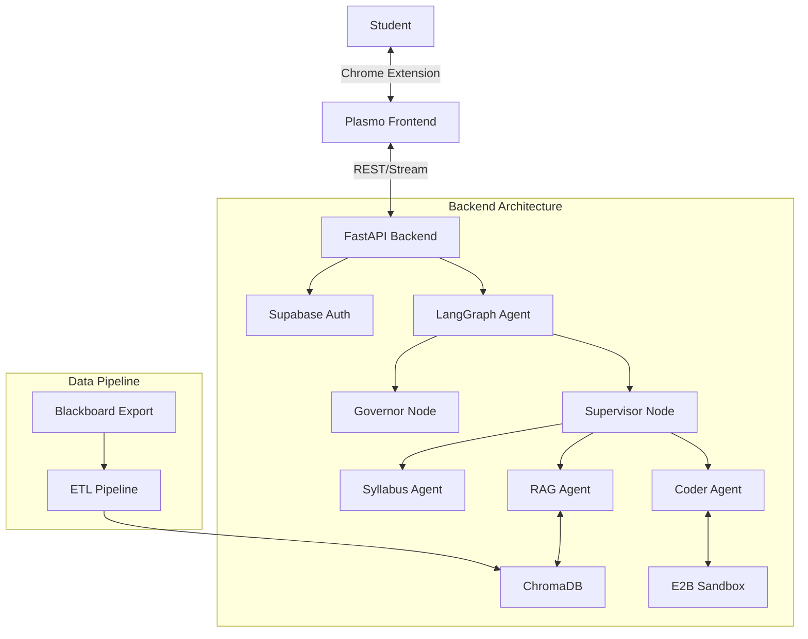

# Architecture Design Document
**Project:** Centennial Course Marshal
**Version:** 1.0

## 1. System Overview
The Course Marshal is a **hybrid-architecture AI Tutor**. It consists of a local-first Chrome Extension (Frontend) communicating with a centralized, stateful Python Backend (Brain). The system is designed to be "RAG-heavy" and "Policy-strict".

### High-Level Diagram

---

## 2. Core Components

### 2.1 The Agentic Brain (LangGraph)
The core logic resides in `backend/app/agents`. It uses a **Governor-Supervisor-Worker** topology.

1.  **Governor Node (The Guard):**
    -   Intercepts every user message *before* LLM processing.
    -   **Law 1 (Scope):** Checks ChromaDB for semantic relevance. If distance > threshold, reject.
    -   **Law 2 (Integrity):** Regex/Keyword check for cheating patterns (e.g., "write code for assignment 1").
    -   **Law 3 (Mastery):** (Planned) Checks user's mastery level before revealing advanced answers.

2.  **Supervisor Node (The Router):**
    -   Classifies intent: `fast_chat` vs `complex_reasoning` vs `coding_task`.
    -   Routes to specific sub-agents.

3.  **Workers:**
    -   **RAG Agent:** Standard Retrieval Augmented Generation.
    -   **Syllabus Agent:** specialized RAG for dates, grading, and logistics.
    -   **Coder Agent:** Writes Python code and executes it in E2B.

### 2.2 The Frontend (Plasmo)
-   **Side Panel API:** We use `chrome.sidePanel` for a persistent experience.
-   **Auth Boundary:** Supabase Auth protects all API calls.
-   **State:** React Query + Local Storage (for non-sensitive preferences).
-   **Streaming:** Server-Sent Events (SSE) parsed manually to support custom events (`reasoning-delta`, `sources`).

### 2.3 Data Strategy
-   **Vector Store:** ChromaDB (Local persistence).
-   **Embeddings:** Google Gemini Embeddings (`models/embedding-001`).
-   **Chunking:** RecursiveCharacterTextSplitter (chunk_size=1000, overlap=200).
-   **Metadata:** Each chunk carries `source_file`, `page_number`, and `course_id`.

---

## 3. Key Decisions & Trade-offs

| Decision | Alternative | Reason |
|----------|-------------|--------|
| **Plasmo vs Next.js** | Next.js | Plasmo allows direct browser integration (reading current tab URL, side panel UX). |
| **LangGraph vs Chains** | Standard Chains | We need cyclical logic (loops) and distinct state management for the Governor. |
| **Supabase Auth** | Custom JWT | Offloads security, handles OTP, provides RLS for DB. |
| **ChromaDB** | Pinecone | Zero cost, local docker deployment, sufficient for <100k chunks. |

## 4. Future Scalability
-   **Multi-Course:** The schema supports `course_id`. Currently hardcoded to `COMP237`.
-   **Cloud Deployment:** The Docker setup is ready for Railway/Render.
-   **Observability:** Langfuse hooks are present in the codebase, ready to be enabled.

